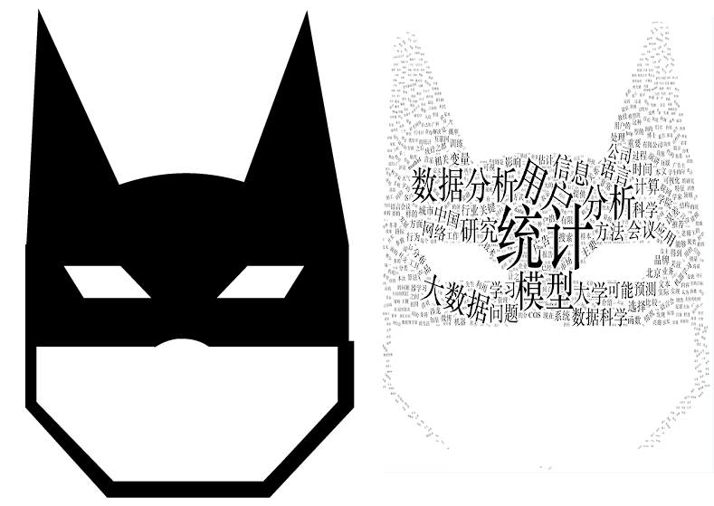

#目录

#### 1. [安装](#install)
#### 2. [示例](#example)
* 2.1 [一般示例](#example1)
* 2.2 [定制颜色](#example2)
* 2.3 [定制形状](#example3)
* 2.4 [文字云词图](#example4)

#### 3. [交互](#jiaohu)

现在你也可以在R语言中绘制多样的词云了。[wordcloud2](https://github.com/Lchiffon/wordcloud2)是基于[wordcloud2.js](https://github.com/timdream/wordcloud2.js)封装的一个R包，使用HTML5的canvas绘制。浏览器的可视化具有动态和交互效果，相对于曾经的R包worldcoud，wordcloud2还支持任意形状的词云绘制，这也是我一直想要寻求的特性。

#1.安装 {#install}

从github安装wordcloud2包:
```{r eval=FALSE}
if (!require(devtools)) install.packages("devtools")
devtools::install_github('lchiffon/wordcloud2')
```

#2.示例 {#example}

### 2.1 一般示例 {#example1}
wordcloud2包内含有两份data.frame格式的词频数据：英文版的**demoFreq**和中文版的**demoFreqC**，使用wordcloud2直接绘制即可。若需要绘制自己的词频数据，只需构造一个类似的数据框即可，*第一列代表词语，第二列存贮相应的词频*。
```{r message=FALSE, warning=FALSE}
library(wordcloud2)
wordcloud2(demoFreqC, shape = "diamond")
wordcloud2(demoFreq, shape = "star", backgroundColor = "black")
```

### 2.2 定制颜色 {#example2}

这里的颜色包括背景色和词语颜色，分别对应**backgroundColor**和**color**两个参数。这两个参数可以接受CSS认可的任意的参数值，如'red','blue'或者'rgb(0,0,0)'以及十六进制的'#ff2fe9'等。

另外**color**参数有更多可接受的参数：

* 内置的随机色生成方案: **random-light**和**random-dark**，在javasript里定制了相应的随机函数
* javasript回调函数: 用js撰写任意的颜色生成函数，如

```{r message=FALSE, warning=FALSE}
js_color_fun = "function (word, weight) {
    return (weight > 1000) ? '#f02222' : '#c09292';
}"
wordcloud2(demoFreqC, color = htmlwidgets::JS(js_color_fun), 
           backgroundColor = 'black')
```
此处需要使用htmlwidgets的JS函数把字符形式的参数值解析成js函数。

R中的函数向量: js回调函数想必让很多纯R语言用户懵逼，最简单的方式是传入一个定制后的颜色向量。**wordcloud2(demoFreqC, color = ifelse(demoFreqC[, 2] > 2000, '#f02222', '#c09292')**这行代码R语言函数代替了js回调函数，效果相同。

###  2.3 定制形状 {#example3}
学会定义颜色可以让你的词云时黄时紫，却不能像马像牛又像羊。变形最简单的方式就是定义**shape**参数，如wordcloud2(demoFreqC,shape='star')。还支持'diamond','cardioid'等参数(都是在js脚本中预定义好的对应的函数)，更多请看函数帮助文档。

内置的几个参数并不十分有趣，完全的自定义才亦可赛艇。**wordcloud2**允许你传入一张图片，把词云填充在图中的黑色区域。

```{r eval=FALSE}
wordcloud2(demoFreqC, figPath='batman.png', color = "black", size = 1) 
#由于速度原因这里就没放原图，而是原图的截图。
```



```{r eval=FALSE}
wordcloud2(demoFreq, figPath='spiderman.png', color = "red", size = 1)
#由于速度原因这里就没放原图，而是原图的截图。
```


### 2.4 文字云词图 {#example4}
有些时候，我们除了需要自定义形状，可能也需要形成文字，这就需要用到wordcloud2中的新函数**letterCloud**

```{r eval=FALSE}
letterCloud(demoFreqC, word = "LOVE", wordSize = 2)
```


# 3.交互 {#jiaohu}
    默认生成的词云是自带交互效果的。鼠标悬浮某个词上会显示相应的词频，这是内置的js回调函数效果。可以自编js函数覆盖，比如下边的代码传入一个空函数，画出的词云就没有交互效果了。
    
```{r message=FALSE, warning=FALSE}
hoverFunction = htmlwidgets::JS("function hover() {}")
wordcloud2(demoFreq,hoverFunction = hoverFunction)
```
这一部分就是纯粹的js了，有能力或有兴趣想要做些不一样效果的，可以瞅瞅源代码中的[hover.js](https://github.com/Lchiffon/wordcloud2/blob/master/inst/htmlwidgets/lib/wordcloud2-0.0.1/hover.js)。


**声明：**此笔记内容并非原创，主要参考如下：

[R语言，超级英雄云词图，你们要的自定义形状来了（附完整教程）](http://mp.weixin.qq.com/s?__biz=MzAxNzc3NDA3OA==&mid=2651304504&idx=1&sn=70f4f11303fd64ffa439d82b217a932a&scene=23&srcid=0622Wa1sqQitT52mAzt4ADk7#rd)

[R语言词云终极解决方案—wordcloud2包](http://www.xueqing.tv/cms/article/226)